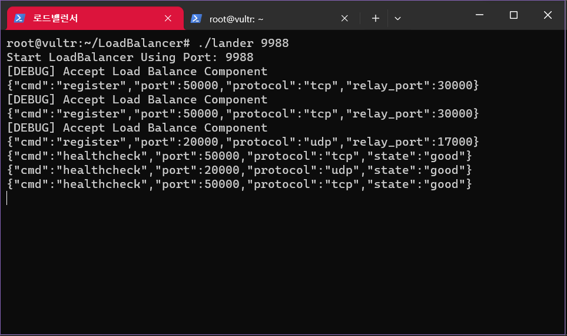
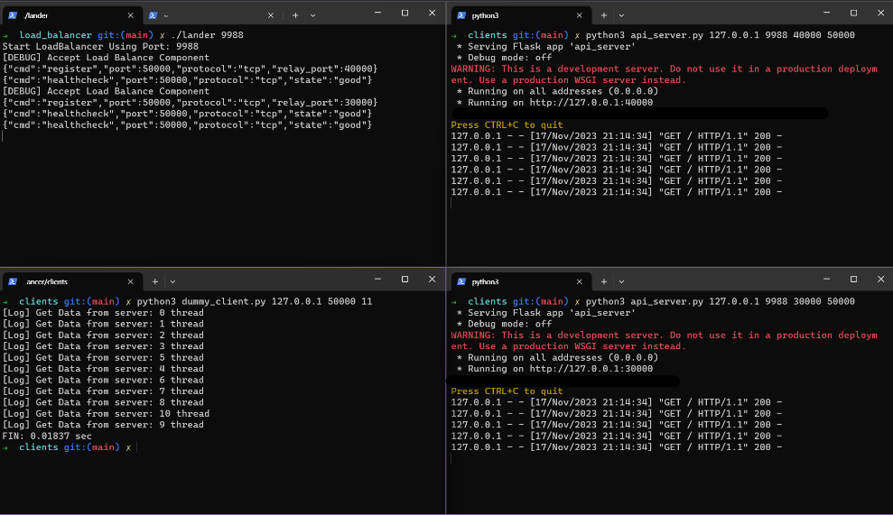

# Load Balancer for C/C++ 
로드밸런서의 프론트엔드입니다. 로드밸런싱을 필요로 하는 여러 Tcp 서버나 Udp 서버에 패킷을 라운드로빈 형식으로 전달합니다. 

# Architecture
다중 소켓통신에 있어 스레딩 모델과 다중 입출력 모델이 존재할 수 있습니다. 스레딩 모델의 경우 아키텍쳐 레벨에서는 간단하게 보일지라도 동기화 매커니즘에 있어 매우 복잡하기에 아키텍쳐 레벨에서는 복잡할 수 있어도 구현에 간단한 이점을 가질 수 있도록 스레드를 사용하지 않고 모든 논블럭 소켓(tcp, udp)을 EPOLL을 통해 관리할 수 있도록 구현했습니다.  

epoll의 edge-trigger이 아닌 level-trigger을 채택한 이유 또한 edge-trigger의 경우 즉시 처리를 안해도 되는 이점이 있지만 한번 알림받은 데이터는 그 순간에 모든 데이터를 읽어야 합니다. 구현한 로드밸런서 특징상 추가적인 스레드를 사용하지 않고 단일 스레드에서 처리한다는 점, 한번 읽고 남은 데이터는 다음 알림 때 읽기 시도한다는 점으로 level-trigger 방식을 채택했습니다.  


위의 사진은 전반적은 프로젝트의 아키텍쳐입니다.   
컴포넌트, 클라이언트등 로드밸런서 내부에서 만들어진 모든 소켓은 epoll을 사용하여 단일 스레드에서 관리합니다.  

### 컴포넌트 등록 및 제거
먼저 로드밸런싱을 원하는 TCP 또는 UDP서버가 로드밸런서 서버에 TCP 연결을 요청합니다. 커넥션이 맺어진 이후 각 컴포넌트(서버)들은 msgpack을 사용하여 register 명령을 보내 자신의 서버가 오픈한 포트번호, 프로토콜 종류, 로드밸런서 서버에 바인딩하고 싶은 포트번호를 전송합니다.  

### 소켓 바인드 
register 명령어를 받은 로드밸런서는 프로토콜 번호와 바인딩 포트가 이미 있는지 확인합니다. 있다면 레퍼런스 카운트만 올리고 없다면 해당 포트와 프로토콜로 소켓을 만들고 바인드하여 외부 클라이언트와의 연결을 준비합니다.  
이 때 만들어진 소켓 또한 epoll의 관심 파일 디스크립터로 등록합니다.  

### 데이터 릴레이 
바인딩된 소켓에 외부의 클라이언트로부터 데이터가 도착한다면 서버는 해당 패킷을 읽어들이고 새로운 소켓을 만들고 라운드로빈에 의해 결정된 컴포넌트에게 데이트를 전송합니다. 이 때 만들어진 소켓또한 epoll의 관심 파일 디스크립터로 등록하여 컴포넌트로부터 데이터가 왔을 때 데이터를 읽을 수 있도록 합니다.  
만약 epoll에 의해 알림이 왔다면 해당 데이터를 읽고 처음 연결했던 클라이언트에게 전달합니다. 


# Control Channel
- Register 
```json
{
    "cmd" : "register", 
    "protocol" : "tcp", 
    "port" : 30000, 
    "relay_port" : 50000 
}
```
동일한 API서버가 다른 머신에서 돌아간다면 port와 relay_port는 동일하지만 동일 머신에서 테스트하기 위해 다른값으로 세팅했습니다. 

port : 실제 API서버가 오픈한 포트   
relay_port : 로드밸런서가 동작하는 머신에서 바인딩할 포트 
  
클라이언트는 relay_port로 접근을 시도합니다.   
로드밸런서는 relay_port를 실제 API서버의 port로 패킷 릴레이  

- UnRegister
```json 
{
    "cmd" : "unregister", 
    "protocol" : "tcp", 
    "port" : 30000, 
    "relay_port" : 50000 
}
```

- Health Check 
```json 
{
    "cmd" : "healthcheck",
    "protocol" : "tcp", 
    "port" : 50000, 
    "state" : "good"
}
```
5초마다 연결된 서버들에게 보내는 상태 메시지 

# Dependency
- Python 3.10 이상 
- pip 패키지 관리 도구
- make 4.3 
- g++ 11.4.0 

```Shell
pip install flask 
pip install requests
pip install msgpack
```

# How to execute
### Load Balancer 실행
```Shell
git clone https://github.com/txuna/LoadBalancer.git
cd LoadBalancer 
make 

./lander [포트번호]
```

### Flask 서버 실행
```Shell
cd LoadBalancer/clients
python3 api_server.py [LoadBalancer IP] [LoadBalancer Port] [API Server Port] [Bind Port(Relay)]
```

### UDP Echo 서버 실행 
```Shell
cd LoadBalancer/clients
python3 udp_server.py [LoadBalancer IP] [LoadBalancer Port] [API Server Port] [Bind Port(Relay)]
```

### Tcp 테스트 클라이언트 실행 
```Shell
cd LoadBalancer/clients
python3 dummy_client.py [Server IP] [Server Port] [num of request]
```

### Udp 테스트 클라이언트 실행 
```Shell
cd LoadBalancer/clients
python3 udp_dummpy_client.py [Server IP] [Server Port] [num of request]
```

# Result 
### Controll Channel 
- 로드밸런싱 서버 실행


- 2개의 TCP Flask 서버 추가(실제 바인딩 포트30000, 릴레이 포트 50000)   
- 1개의 UDP Echo 서버 추가(실제 바인딩 포트 17000, 릴레이 포트 20000)


### Bind Port 
- 바인딩 포트 결과

1. 로드밸런서 TCP 9988 오픈 성공 
2. Flask 서버 TCP 40000 오픈 성공 및 로드밸런서 바인딩 포트 50000포트 오픈 성공 
3. Flask 서버 TCP 30000 오픈 성공 및 바인딩 컴포넌트 추가 성공 
4. Udp Echo 서버 UDP 15000 오픈 성공 및 로드밸런서 바인딩 포트 20000포트 오픈 성공 

# Relay 
현재 1대의 UDP서버와 2대의 Flask서버 연결
###  Flask 테스트  
- Client  
서버로 11개의 요청을 보냄



### Udp Echo 테스트 
- Client  
서버로 11개의 요청을 보냄  


# Performance 
```Python
for i in range(1, 100000000):
    count += i
```
서버들은 반복문으로 3초 정도 걸리는 덧셈 연산을 수행하고 클라이언트에게 던져줍니다. 로드밸런싱에 추가한 서버와 1~1000개의 더미 클라이언트를 실행하여 속도를 체크합니다. 

### 요청 클라이언트 10개 - 표
|프로토콜|서버1대|서버2대|서버4대|
|------|---|---|---|
|TCP|25초|13초|14초|
|UDP|26초|15초|14초|

### 요청 클라이언트 100개 - 표
|프로토콜|서버1대|서버2대|서버4대|
|------|---|---|---|
|TCP|316초|163초|171초|
|UDP|270초|165초|161초|

# Comment 
로드밸런서 테스트 결과 추가되는 서버수에 따라 1개에서 2개로는 2배 이상의 시간을 절약하지만 TCP와 UDP 모두 3개 4개 이상의 경우 시간적인 효과는 확인할 수 없었음  

또한 재미있는 결과또한 얻을 수 있었다. Flask API 서버는 대략 20K의 데이터를 클라이언트에게 주는 기능이 있을 때 로드밸런서에 연결된 서버가 증가할 때 마다 TCP 연결의 처리 성공률이 올라가는 것을 알 수 있었다. 

TCP 1000개의 요청을 벌스트하게 보냈을 때이다.

|비고|서버 1대|서버 2대|서버 3대|서버 4대|
|------|---|---|---|---|
|성공횟수|728개|876개|951개|953개|
|실패횟수|272개|124개|49개|47개|
|성공률|72.8%|87.6%|95.1%|95.3%|